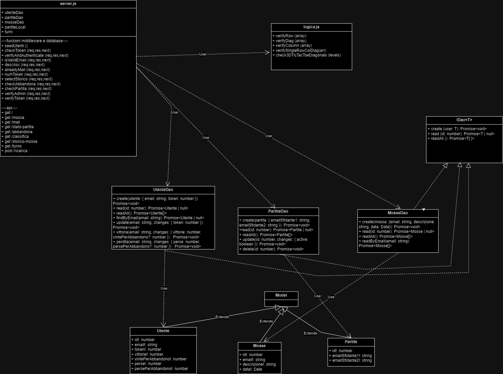
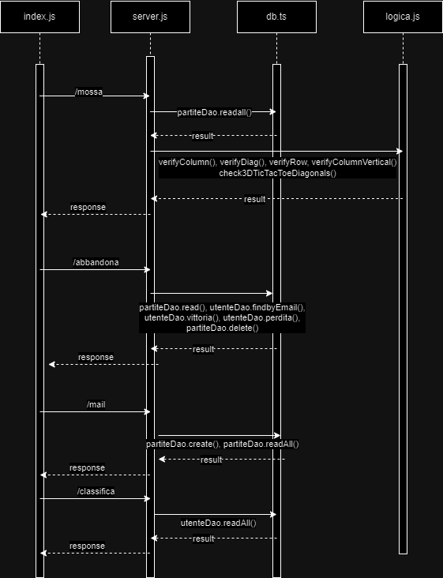
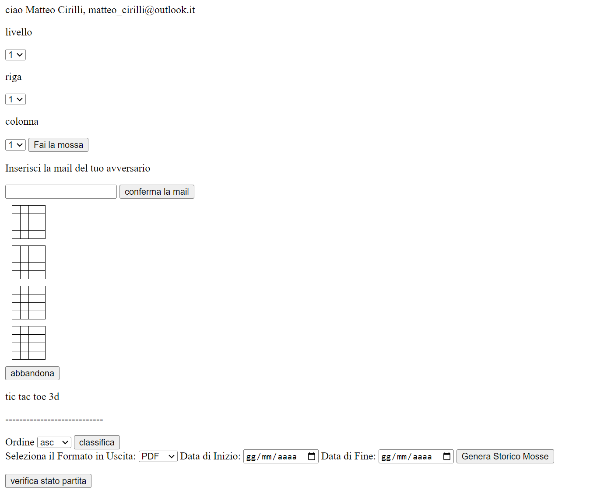

# PROGETTO PROGRAMMAZIONE AVANZATA - TIC TAC TOE 3D

## Obiettivo del Progetto

L'obiettivo del progetto era realizzare un server express su Node.js che permettesse di giocare a Tic Tac Toe 3D. Questo gioco, rispetto alla versione classica, differisce sul fatto che oltre a vincere tramite diagonali, righe e colonne sullo stesso livello, si può vincere anche mettendo tutti simboli uguali su una colonna in verticale o su una diagonale in verticale, attraversando i 4 livelli.\
Il sistema doveva permettere ad utenti autenticati di effettuare delle partite, inserendo la mail dell'avversario. Come da specifiche, per ogni partita creata vengono tolti 0.5 token, e nel caso i token non siano sufficienti l'applicazione restituisce l'errore *401 unauthorized*.\
Ogni utente può vedere la classifica, che è una rotta pubblica, lo storico delle mosse, può controllare se sia il suo turno o meno, ed effettuare una mossa. Lo storico delle mosse è sia visibile in Json che scaricabile in Pdf.\
In ogni momento la partita può essere abbandonata, e nella classifica risulterà che tra le partite perse ce ne sarà una persa per abbandono, allo stesso modo per chi ha vinto risulterà una partita vinta per abbandono; sia nel caso della vittoria 'legittima' che per abbandono, i punti assegnati saranno 5, che poi determineranno l'ordine della classifica (consultabile sia in ordine ascendente che discendente).
Se un utente è di ruolo admin (è presente il parametro admin nel token JWT) allora può accedere alla rotta post che permette di ricaricare i token di un determinato utente. 

## Progettazione

### Diagrammi UML

Descrizione dei diagrammi UML utilizzati per progettare il sistema. 
Sono presenti il diagramma delle classi e il diagramma delle sequenze.




### Pattern utilizzati

Descrizione dei design pattern utilizzati nel progetto e dei motivi di utilizzo.

#### Middleware
Il Middleware è un pattern che serve per filtrare le richieste prima che arrivino al server Express. In particolare due funzioni, ovvero *checkToken* e *verifyAndAuthenticate* sono nel middleware di tutte le richieste *get*, meno che nella rotta */classifica*, in quanto è stata realizzata come unica rotta pubblica.
- `checkToken`: verifica se c'è un token nell'header di autenticazione, nel caso in cui ci sia chiama attraverso la *next()* la funzione di middleware successiva, altrimenti manda indietro un codice di errore.
```javascript
function checkToken (req,res,next){
   const bearerHeader = req.headers.authorization;
    if (typeof bearerHeader!=='undefined') {
        const bearerToken = bearerHeader.split(' ')[1];
        req.token=bearerToken;
        next();
        console.log(req.token);
    }
    else {
        res.status(403).json({error: "non ti sei autenticato"});
   }
```

- `verifyAndAuthenticate`: verifica la firma del token utilizzando una chiave segreta.
```javascript
 let decoded = jwt.verify (req.token, process.env.SECRET_KEY);
```
Queste funzioni sono utilizzate per garantire che tutte le richieste siano autenticate e autorizzate correttamente.

Poi sono presenti altre varie funzioni che servono per arricchire le richieste e bloccarle in alcuni casi, quando non vengono superati alcuni controlli.
Ad esempio è presente la funzione *isValidEmail* che verifica che un email sia inserita con il corretto formato; oppure la funzione *numToken* che verifica se il numero di token di un utente è sufficiente per iniziare una partita, ovvero se sono maggiori di 0.5.


#### DAO (Data Access Object)
Il pattern DAO è utilizzato per astrarre la parte di persistenza.
In questo progetto il DAO è risultato utile in quanto nel server express, ovvero nel file *server.js*, risulta possibile accedere ai dati del database senza utilizzare direttamente le CRUD.
Il DAO consente infatti di nascondere questa parte.\
Inoltre, all'interno dei metodi del DAO non vengono comunque usate le CRUD, in quanto l'*ORM* **sequelize** consente di lavorare con classi e oggetti invece che con tabelle del database e query sql.\
Nel file *db.ts* vengono definiti e inizializzati i modelli **Utente**, **Partite** e **Mosse** che mapperanno le rispettive tabelle nel database.
Poi sono presenti rispettivamente:
- `Interfaccia del DAO`: l'interfaccia del Dao con i metodi *create*, *read* e *readAll*, i quali creano, leggono un elemento, e leggono tutti gli elementi.
```typescript
interface IDao<T> {
    create(user: T): Promise<void>;
    read(id: number): Promise<T | null>;
    readAll(): Promise<T[]>;
}
```
- `Implementazioni del DAO`: le implementazioni del DAO che corrispondono alle 3 tabelle, ovvero *UtenteDao* con le implementazioni dei metodi per interagire con la tabella utente, e *PartiteDao* e *MosseDao* per le altre due tabelle.

```typescript
export class UtenteDao implements IDao<Utente>
```
In queste classi, oltre ai metodi predefiniti che sono presenti nell'interfaccia, sono aggiunti metodi specifici che servono per lavorare con le differenti tabelle del database.

## Tecnologie utilizzate
### Linguaggi di programmazione
- `Javascript`: utilizzato per il *server.js* e per *logica.js*, quindi per il server express e per la parte di logica, dove ci sono le funzioni che servono per verificare se uno dei due utenti ha vinto la partita.
- `Typescript`: utilizzato per *db.ts*, in quanto *sequelize* è un *ORM* che richiede tipizzazione, infatti i dati ritornati dal DB devono essere mappati in classi di un certo tipo, con attributi con un tipo ben determinato.
### Node e moduli
- `Node.js`: runtime system utilizzato per interpretare il codice javascript, indispensabile per realizzare il server express.
- `Express`: framework utilizzato per realizzare il server web. Express infatti serve per creare api e applicazioni web, e si adatta molto bene all'utilizzo del pattern 'middleware'.
- `Path`: modulo per lavorare con percorsi di file e directory.
- `dotenv`: modulo per accedere nel codice a variabili d'ambiente. Nel caso di questo progetto è servito per accedere alla chiave privata utilizzata per verificare i token JWT.
- `jsonwebtoken`: utilizzato per lavorare con i token JWT. Indispensabile per questo progetto in quanto l'autenticazione degli utenti avviene proprio mediante questi token.
- `Memory Store`: modulo per la soluzione temporanea di dati in memoria, utilizzato per memorizzare le sessioni dei vari utenti.
- `Express Session`: middleware per gestire le sessioni utente.
- `fs`: modulo nativo per interagire con il file system, utilizzato per salvare pdf.
### Rendering
- `EJS`: sta per Embedded JavaScript, è un motore di template utilizzato per generare HTML dinamico con JavaScript. EJS consente di inserire codice JavaScript direttamente nei file HTML, permettendo la creazione di pagine web dinamiche in modo semplice e intuitivo. Si è reso utile nel progetto in quanto si voleva che la pagina html cambiasse dinamicamente, che appunto non risultava possibile con l'html classico.

## Dettagli implementativi
### server.js
Nel file *server.js*, ovvero il server express che risponde a tutte le rotte, vengono istanziate due variabili, 'partiteLocal' e 'turni', che serviranno per mantenere le partite attive e i turni delle rispettive partite.
```javascript
var partiteLocal = [];
var turni = [];
```
Come prima cosa viene fatto un seed del database.
```javascript
await Utente.bulkCreate([
        { email: 'matteo_cirilli@outlook.it', token: 100, vittorie: 0, vintePerAbbandono: 0, perse: 0, persePerAbbandono: 0 },
        { email: 'mariorossi@gmail.com', token: 200, vittorie: 0, vintePerAbbandono: 0, perse: 0, persePerAbbandono: 0 },

    ]);
```
Vengono anche istanziati i DAO delle varie tabelle, che serviranno poi per accedere ai dati nel database.
```javascript
const { UtenteDao, PartiteDao, MosseDao, syncDb, Utente } = require('./dist/db.js');
const utenteDao = new UtenteDao();
const partiteDao = new PartiteDao();
const mosseDao = new MosseDao();
```
Sono presenti le varie funzioni di middleware, che verrano utilizzate nelle rotte per filtrare le richieste e nel caso ci sia qualcosa di sbagliato ritornare un errore specifico.
Ad esempio abbiamo la funzione *descAsc* che serve per verificare se quando l'utente vuole vedere la classifica, tra i parametri della query ha messo il parametro 'ordine', necessario per questa rotta, se non l'ha messo viene ritornato un errore status 400; nel caso in cui l'abbia messo, il valore deve essere asc o desc, in base al fatto se voglia vedere la classifica in un ordine o in un altro.
```javascript
function descAsc(req, res, next) {
    if (req.query.ordine) {
        if (req.query.ordine === "asc" || req.query.ordine === "desc")
            next();
        else
            res.status(400).json({ error: 'inserisci asc o desc come valore del parametro ordine' });
    }
    else
        res.status(400).json({ error: 'inserisci il parametro ordine, con asc o desc' });
}
```
Molto particolare è l'implementazione della get che risponde alla rotta '/mossa'.\
Prima di tutto si va a vedere se c'è una partita in cui l'email personale, salvata nella sessione come *personalEmail*, è presente come *emailSfidante1* o *emailSfidante2*, se sì viene salvato l'id della partita e in base a se sia il primo o il secondo sfidante viene assegnato il simbolo 'x' o 'o' per la partita.
```javascript
 var partite = await partiteDao.readAll();
        var flag = false;
        partite.forEach(partita => {
            if (((req.session.personalEmail === partita.emailSfidante1) || (req.session.personalEmail === partita.emailSfidante2)) && partita.active === true) {
                flag = true;
                req.session.idMatch = partita.id;
                if (req.session.personalEmail === partita.emailSfidante1)
                    sym = "x";
                else
                    sym = "o";
            }
        });
```
Poi si va a verificare se nella posizione passata come mossa è presente '1' o un simbolo; essendo gli array della partita inizializzati con tutti '1', se è presente 1 vuol dire che la posizione è libera, altrimenti no. Nel caso sia libera vengono chiamate le funzioni di *logica.js*, per testare se successivamente all'inserimento di questo simbolo si verifica una condizione di vittoria o meno.
```javascript
 if (partiteLocal[req.session.idMatch][livello - 1][index] == 1) {
                    partiteLocal[req.session.idMatch][livello - 1][index] = mossa;//altro codice
 }
```
Nel caso in cui ci sia un vincitore vengono aggiornati i dati sia del vincitore sia dello sconfitto.
```javascript
 if (player1) {
    player = await utenteDao.findByEmail(partitaa.emailSfidante1);
    var vittorieAttuali = player.vittorie;
    await utenteDao.vittoria(partitaa.emailSfidante1, {
    vittorie: (vittorieAttuali + 1)
                            }); }
```
In tutti i casi viene mandata come risposta un json, in cui è presente la stringa che determina se c'è stata una vittoria o meno, se ha vinto il giocatore di cui in un certo momento è visualizzata la pagina, qual è il simbolo vincente nel caso, e qual è la posizione che è stata occupata.
```javascript
res.json({
    winner: winner ? "winner" : "no",
    player: ((req.session.personalEmail === partitaa.emailSfidante1) && player1) || ((req.session.personalEmail === partitaa.emailSfidante2) && !player1) ? "yes" : "no",
    symbol: winnersymbol, 
    pos: (index + 1).toString() + x,});
```

### logica.js
In questo file javascript vengono definite le funzioni per verificare se ci sia o meno un vincitore, quindi se ci siano o meno quattro simboli uguali su riga, colonna, diagonale, colonna verticale o diagonale verticale.\ 
Per verificare se ci sia una riga uguale si usa la funzione *verifyRow*.
```javascript
function verifyRow(array) {
    var arr = [...array];
    var flag = false;

    var b = arr.splice(0, 4);
    var c = arr.splice(0, 4);
    var d = arr.splice(0, 4);
    var e = arr.splice(0, 4); // altro codice...
}
```
Questa funzione prende un array come parametro, di cui fa la copia. successivamente fa lo splice, ovvero divide l'array, che rappresenta la tabella di un livello, quindi 16 elementi, in quattro array da 4 elementi, ovvero le 4 righe.\
Successivamente chiama la funzione *verifySingleRowColDiag* su ognuno di questi elementi.
```javascript
if (verifySingleRowColDiag(b) == 1 || verifySingleRowColDiag(c) == 1 || verifySingleRowColDiag(d) == 1 || verifySingleRowColDiag(e) == 1)
        return 1
    else if (verifySingleRowColDiag(b) == 2 || verifySingleRowColDiag(c) == 2 || verifySingleRowColDiag(d) == 2 || verifySingleRowColDiag(e) == 2)
        return 2;
    else return 3;
```
Questa funzione non fa altro che verificare se ci siano 4 elementi uguali, ovvero 4 'o' o 4 'x'; nel primo caso restituisce 2, nel caso delle x restituisce 1, e nel caso non ci siano elementi uguali restituisce 3.
```javascript
function verifySingleRowColDiag(arr) {
    var x = 0;
    var o = 0;
    for (var i = 0; i < arr.length; i++) {
        if (arr[i] == "x")
            x++;
        else if (arr[i] == "o")
            o++;
    }
    if (x == 4)
        return 1;
    else if (o == 4)
        return 2;
    else return 3;
}
```
### index.ejs e parte grafica
Nel progetto viene utilizzato un file .ejs per la parte grafica.

Nell'interfaccia sono presenti le form e i bottoni che consentono di richiamare le rotte del server. Ad esempio abbiamo una form per inserire la mail, una per abbandonare la partita, una per visualizzare lo storico delle mosse...\
Vengono utilizzati degli event listener, che in risposta a 'click' o 'submit' fanno una *fetch* chiamando le rotte del server express.
```javascript
  document.getElementById('abbandona').addEventListener('click', function () {
  fetch('\abbandona')
      .then(response =>response.text())
        .then(data => {
          alert(data);})
          .catch(error => {
                console.error('Errore:', error);
            });
});
```


## Come Avviare il Progetto con Docker

Istruzioni per avviare il progetto utilizzando Docker.

1. **Clonare la Repository**:

    ```bash
     git clone https://github.com/matteocirilli/progetto_prog_avanzata
    cd progetto_prog_avanzata
    ```
2. **Avviare Docker**

3. **Costruire l'Immagine Docker**:

    ```bash
    docker build -t nomeimmagine .
    ```

4. **Avviare il Container Docker**:

    ```bash
    docker run -d --name nomecontainer -p 3000:3000 nomeimmagine:latest
    ```

5. **Accedere al Progetto**:

In quanto il l'applicazione richiede delle rotte autenticate, non risulta possibile testare il gioco utilizzando un browser, come ad esempio Google Chrome.\
Questo perché Chrome non permette di modificare l'authentication header, e quindi mettere un token JWT come 'bearer token'. Per testare il progetto si possono utilizzare le collection di query successivamente menzionate, che riescono bene a distinguere i vari casi d'uso e scenari dell'applicazione.\
Se invece si vuole testare l'interfaccia grafica, interagendo quindi con l'applicazione tramite interfaccia EJS, si può andare a modificare leggermente il codice, commentando una parte di *checkToken*, e ripristinandone invece la parte successiva.
```javascript
//per verificare interfaccia grafica commentare da qui
//a qui
```
```javascript
//per verificare interfaccia grafica ripristinare questa parte
```


## Test delle Rotte con Postman

Istruzioni su come testare le API del progetto utilizzando Postman. Ci sono tre collection: la prima rappresenta il caso d'uso di una partita che termina con una vittoria, più altri test vari, la seconda una partita che viene abbandonata, e la terza la ricarica da parte di un admin.

1. **Importare la Collezione di Postman**:

- Collezione postman partita vinta: [link](https://api.postman.com/collections/34960052-1c035c9a-fc3f-4bba-beaa-e406903f6d1b?access_key=PMAT-01J2E08G2978RKCN22RNM2ZEB3)
- Collezione postman partita abbandonata: [link](https://api.postman.com/collections/34960052-9325fd1e-614b-4277-99db-3980f64bf4ec?access_key=PMAT-01J2E0FZYBHNCZYDMY8Y2NVMAE)
- Collezione postman partita abbandonata: [link](https://api.postman.com/collections/34960052-fae6f46a-1c1f-40c9-85fb-93ca00461abb?access_key=PMAT-01J2E45M5C7DKSNGEP639YG59H)
- Apri Postman e importa le collezione scaricate.

2. **Eseguire i Test**:

    - Seleziona la collezione importata.
    - Clicca su "Run" per eseguire tutti i test delle rotte.


